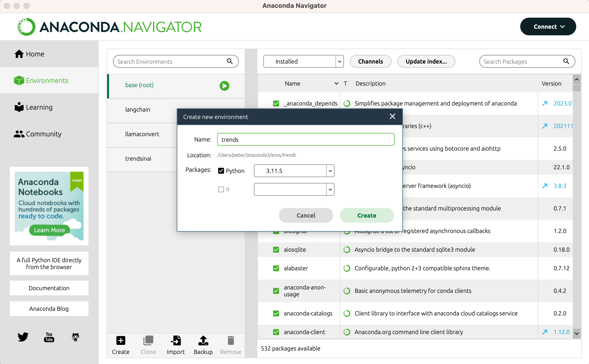
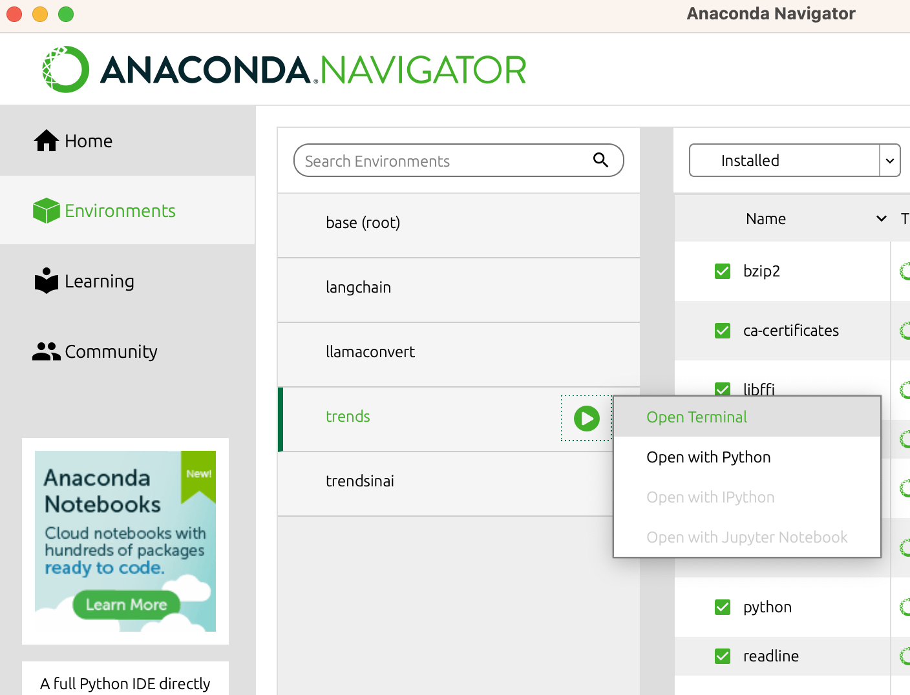
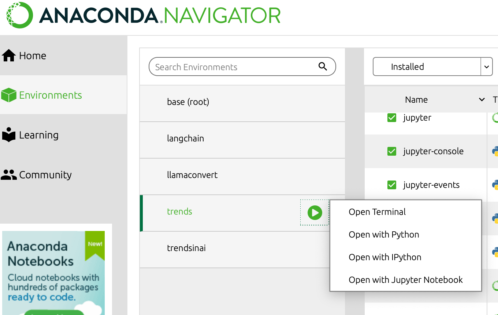
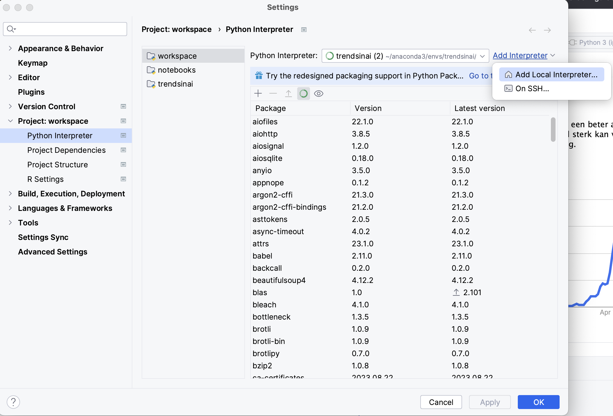
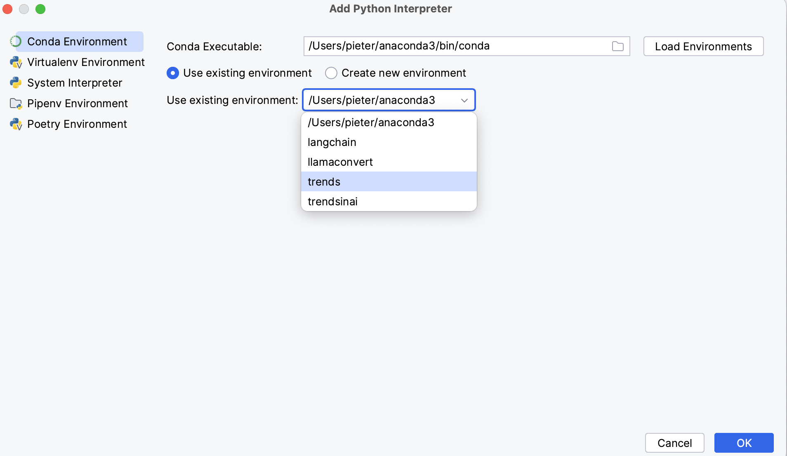

# DataSpell samen met Anaconda Navigator

Aangezien docker installeren bij best wat studenten problemen gaf, voorzie ik een (makkelijk) alternatief om alles vlot te draaien voor deze cursus. 

Alle libraries globaal installeren is echt geen goed idee, vroeg of laat gaat dat problemen en conflicten geven.


Hiervoor dien je hetvolgende te installeren

- anaconda navigator (laat toe om makkelijk verschillende virtuele python environments te creëeren en beheren) https://docs.anaconda.com/free/navigator/install/
- DataSpell, de Jetbrains "IDE for data scientists", gratis als je student bent https://www.jetbrains.com/dataspell/


Open dan anaconda navigator en maak een nieuwe environment aan




Klik deze aan zodat je naar deze environment switcht (dit zal even duren), als je dan op de "play" knop duwt zal IPython en notebooks normaal nog greyed zijn.




Kies de `Open Terminal` optie, en typ in de terminal

```bash
conda install jupyter
```

Dit zal een aantal extra libraries installeren binnen deze environment, klik in anaconda op "update index" en dan zou nadien de optie beschikbaar moeten zijn




Open nu de DataSpell editor, ga naar `Settings > Project Workspace > Python Interpreter`



Klik op de `Add Interpreter` en kies `Add Local Interpreter`. Kies hier dan de environment die je net aangemaakt hebt bij `Use Existing Environment`




En dan is je DataSpell omgeving gelinkt met je anaconda. Als je niet compile errors krijg omwille van missing libraries kan je zo gewoon vanuit DataSpell laten installeren (ze zullen dan mooi in de aparte environment geïnstalleerd worden i.p.v. globaal)

