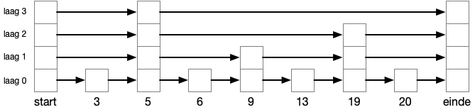

## vector databank

## inleiding

'Klassieke' (relationele) databanken zijn erg goed in het opslaan en ophalen van grote hoeveelheden data, zolang je op zoek gaat naar data die opgeslagen is. Exact wat we van klassieke databanken verwachten, iets opslaan om later weer op te halen. Gestructureerde data met duidelijke relaties, relationele databanken zijn uiterst geschikt om hierop performante complexe queries uit te voeren.

Binnen machine learning wordt data efficiënter voorgesteld als vector data. Vaak werken we met hoog dimensionale data, die kan makkelijk(er) worden voorgesteld als punten in een hoog dimensionale ruimte.

We moeten ook vaak op zoek gaan naar 'gelijkaardige' resultaten, veeleer dan exact terug vinden wat we er eerder instopten. Na het trainen van een neuraal netwerk is het net niet de bedoeling om de input data exact terug te krijgen.

In de vectorruimte worden gelijkenis en verschil tussen datapunten vaak berekend op basis van de afstand tussen hun vectorrepresentaties  (bijvoorbeeld via de Euclidische afstand), dus hebben we ook hiervoor baat bij vector data.

## gelijkaardige data zoeken

Gelijkaardige data zoeken op basis van numerieke criteria is sowieso simpel en efficiënt. Stel als voorbeeld dat we een schoenenwinkel website beheren, alle schoenen ophalen van maat 44 tot 46, of alle schoenen die tussen €100 en €150 kosten zijn triviale queries, waarvoor relationele databanken heel geschikt zijn.

Maar wat als we ook 'gelijkaardige' resultaten willen opvragen. Als de klant zoekt naar 'zwarte schoen', willen we sectie op de site "misschien interesseren deze schoenen jou ook" waar we bijvoorbeeld ook donkerblauwe schoenen tonen in hetzelfde model, maar geen witte.

Het systeem moet dus op een manier kunnen voorstellen dat 'donkerblauw' meer verwant is met 'zwart' dan dat 'wit' dat is. Dit soort kenmerken worden heel vaak als vectors voorgesteld. Door elk van de kenmerken op een andere as voor te stellen binnen een multi dimensionale ruimte, wordt welke data gelijkaardig is aan andere data makkelijk te definiëren.

De juiste kenmerken op de juiste manier voorstellen is een kunst op zich. Jullie hebben vorig jaar bij machine learning allerlei methodes geleerd om hiermee om te gaan (feature scaling, ordinal encoder, attribute combinations, ...). We gaan er nu verder vanuit dat dit gelukt is, elk kenmerk van onze data is mooi geëncodeerd en goed geschaald. (bvb. het kenmerk 'kleur' van wit tot zwart en alles ertussen, of neem 'stijlvol', van de minst stijlvolle schoenen (crocs?) tot de chiqueste Italiaans lederen schoenen, enz.)

(automatisch kenmerken genereren uit een set van data met machine learning is soms ook een optie, dat leren jullie dit jaar in Deep Learning)

Eens gecodeerd is er in principe niets dat ons tegenhoudt om deze data in verschillende kolommen van een relationele databank te steken, en dan er verschillende queries op los te laten om gegeven één schoen uit deze kolommen de meest gelijkaardige schoenen te vinden. Maar het zal een oplossing zijn die bijzonder slecht schaalt, en dus niet geschikt is als we vaak snel, over grote hoeveelheden data, zo'n operaties willen doen.

We hebben een beter model nodig.

## vector databanken

Vector databanken zijn een poging om deze vectoren op te slaan op een zodanige manier dat we snel gelijkaardige data kunnen vinden.

Als we ons als voorbeeld even beperken tot twee kenmerken (in twee dimensies tekenen is wat makkelijker), dan wordt elke schoen voorgesteld als een vector van twee attributen, of dus een punt in ons vlak.

Gelijkaardige schoenen, zijn dan schoenen die zich dichtbij een schoen bevinden. De afstand tussen twee punten binnen onze vectorruimte kunnen we op verschillende manieren meten (euclidische afstand, manhattan afstand, cosinus, ...).

Als voorbeeld zoeken we de drie meest gelijkaardige schoenen, of dus dichtste schoenen, op basis van de euclidische afstand.

Visueel is het erg makkelijk om in te schatten welke punten het dichtste bij zijn, maar een computer moet de afstand tussen elk paar punten berekenen

$$
d = \sqrt{(y_2-y_1)^2+(x_2-x_1)^2}
$$
Dit schaalt dus absoluut niet als we immense hoeveelheden data beschouwen, we hebben nood aan andere algoritmen om buren te vinden.

## Approximate Nearest Neighbour (ANN)

Het onderliggend idee is dat je de afstanden tussen vector voorstellingen op voorhand uitrekent, en dat je aan de hand van de resultaten gelijkaardige vectoren dicht bij elkaar gaat opslaan (in clusters of grafen) zodat je later sneller gelijkaardige objecten kan terug vinden.

Eigenlijk berekenen we hier een index op de onderliggende data, net zoals we bij relationele databanken indexen gebruiken om sneller data terug te vinden.

Belangrijk om op te merken is dat we hier een trade-off maken tussen snelheid en accuraatheid. We gaan veel sneller de buren vinden, maar het is maar bij benadering ("Approximate")

In ons voorbeeld zou je een cluster van 'donkere schoenen' kunnen aftekenen, als je dan op zoek bent naar de buren van onze bruine Italiaans lederen schoen, gaan we enkel van de schoenen binnen die cluster de afstanden berekenen (en dus niet langer vanuit onze groene crocs).

Er zijn vele manieren om data in clusters e.d. in te delen, en op die manier de zoekruimte te beperken (en dus een beetje accuraatheid op te offeren om wat snelheid terug te krijgen).

Één van de meer gebruikte in moderne vector databanken is Hierarchical Navigable Small Worlds (HNSW), maar om dat te kunnen uitleggen gaan we eerst een kleine omweg maken.

## Probability Skip List

Vergeet even waar we mee bezig zijn, beschouw dit volledig nieuw probleem.

Als we een aantal elementen hebben, waarin we snel willen kunnen zoeken, dan is de simpelste methode om ze in een array te steken en Binary Search toe te passen. Als we echter ook snel elementen willen kunnen toevoegen (en we hebben er héél veel) dan hebben we een andere data structuur nodig, een gelinkte lijst.

Binary search is echter niet toe te passen op gelinkte lijst, we kunnen enkel voorwaarts door de lijst gaan, of alleszins niet op een random manier. Maar telkens de gehele lijst doorlopen om een element te vinden is allesbehalve snel, zeker bij grote lijsten.

De oplossing voor dit probleem die William Pugh in 1990 bedacht noemen we een Probability Skip List.

Zoals alle performantie problemen in de informatica, lossen we ook dit op met een trade-off. Veel sneller zoeken met als kost iets meer geheugen gebruik.

We voegen een aantal lagen toe, die telkens meer en meer elementen 'overslaan', een voorbeeld.

Het algoritme werkt nu door in de bovenste laag te starten, en door de hele lijst te gaan (maar dus veel sneller, want heel veel elementen worden overgeslaan). Van zodra we op een element komen dat groter is dan waarnaar we zoeken, keren we een stap terug, en zakken we een laag.

Dit blijven we doen tot we het element gevonden hebben, of op de laagste laag beland zijn.

(Het is belangrijk op te merken dat `laag n-1` altijd misntens alle nodes van `laag n` bevat, anders werkt het algoritme niet.)

Een voorbeeld, we zijn op zoek naar element 9.

## Navigable Small World (NSW)

Navigable Small World is een algoritme waar het uitgangspunt is dat er een beperkt aantal nodes zijn in de wereld (vandaar 'small world'), en dat de verschillende nodes enerzijds hun directe (dichte) buren kennen, en anderzijds er hier en daar een verbinding is met een verre buur (en er dus grote sprongen in de wereld kunnen gemaakt worden)

Als je dan vanop een startpunt op zoek gaat naar een bepaalde node kan je via een greedy routing algoritme, dat telkens de node kiest die het dichtst bij ons doel ligt, wel zeer efficiënt een lokaal minimum vinden van een 'dichtste' node.

## Hierarchical Navigable Small World (HNSW)

Als we de vorige twee ideeën combineren becomen we het HSNW algoritme. We gaan NSW toepassen, maar dan in verschillende layers.

​									(afbeelding bron: pinecone.io)

We passen dezelfde operaties toe dan bij NSW, maar dan layer per layer, we vinden telkens een lokaal minimum, en 'zakken' dan door naar de volgende layer, om een meer precies resultaat te bekomen.

